# ctrlX Cumulocity thin-edge.io — User Manual

**App**: `ctrlx-cumulocity-thin-edge-io`  
**UI URL**: `https://<ctrlx-ip>/thin-edge-io/`

> **Screenshots**: Take one screenshot per section listed in the [checklist](#screenshots-checklist) at the end of this document. Save them to `docs/pictures/` and replace each `` placeholder.

---

## Table of Contents

1. [Overview](#1-overview)
2. [Connection Status](#2-connection-status)
3. [Cloud Configuration](#3-cloud-configuration)
4. [Device Certificate](#4-device-certificate)
5. [Connect Device](#5-connect-device)
6. [Logs & Diagnostics](#6-logs--diagnostics)
7. [Device Configuration](#7-device-configuration)
8. [Tedge Configuration](#8-tedge-configuration)
9. [Configuration Files](#9-configuration-files)
10. [ctrlX Datalayer Mapping](#10-ctrlx-datalayer-mapping)
    - [Connection Settings](#101-connection-settings)
    - [Node Browser](#102-node-browser)
    - [Mapping Form](#103-mapping-form)
    - [Mapping Table](#104-mapping-table)
11. [C8y Operations & Remote Management](#11-c8y-operations--remote-management)
12. [ctrlX Licensing](#12-ctrlx-licensing)
13. [System Information](#13-system-information)
14. [Screenshots Checklist](#screenshots-checklist)

---

## 1. Overview

The **ctrlX Cumulocity thin-edge.io** app connects a ctrlX AUTOMATION controller to the Cumulocity IoT platform. It forwards telemetry data, manages device certificates, and provides a web-based configuration UI.

**Access**: Open the ctrlX app bar and click **thin-edge.io**, or navigate directly to `https://<ctrlx-ip>/thin-edge-io/`.


The left navigation bar provides quick access to all configuration sections. The language (DE/EN) can be switched in the top-right corner.

---

## 2. Connection Status

**Section**: "Connection Status"

Shows the runtime state of all internal services and cloud bridge connections.

> **Screenshot**: Complete "Connection Status" section
>
> 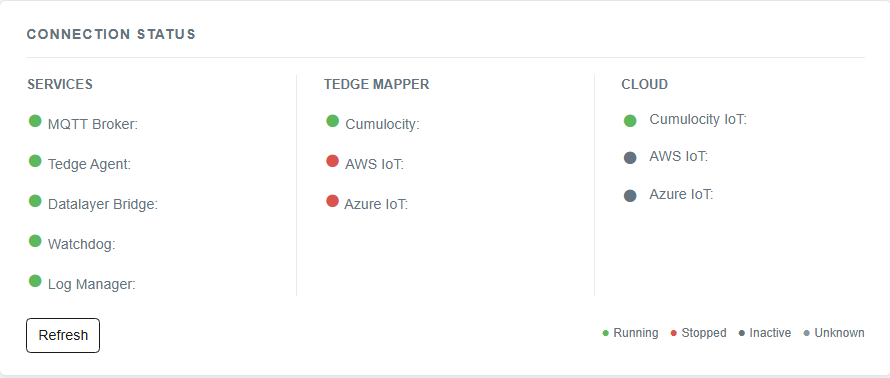

| Indicator | Meaning |
|---|---|
| 🟢 running | Service is active |
| 🔴 stopped | Service has stopped |
| ⚫ inactive | Not configured / disabled |
| 🟡 unknown | State could not be determined |

**Services monitored:**

| Service | Description |
|---|---|
| `mosquitto` | Local MQTT broker |
| `tedge-agent` | thin-edge device agent |
| `tedge-datalayer-bridge` | ctrlX Datalayer → MQTT bridge |
| `tedge-watchdog` | Service health watchdog |
| `webserver` | This configuration UI |
| `tedge-log-upload-manager` | Log upload to Cumulocity |
| `tedge-mapper-c8y` | Cumulocity cloud mapper |
| `tedge-mapper-aws` | AWS IoT mapper |
| `tedge-mapper-az` | Azure IoT Hub mapper |
| `c8y / aws / az` | Cloud bridge connection state |

---

## 3. Cloud Configuration

**Section**: "Cloud Configuration"

Configure the target cloud endpoints.

### Cumulocity IoT (C8y)

> **Screenshot**: Cumulocity tab with URL and MQTT port filled in
>
> 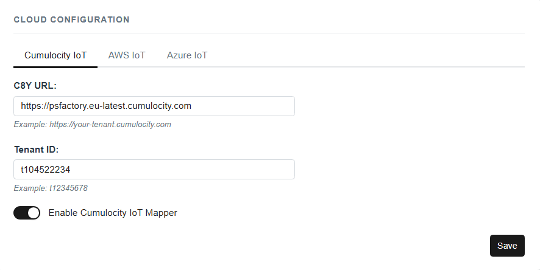

| Field | Description | Example |
|---|---|---|
| **C8y URL** | Tenant hostname | `psfactory.eu-latest.cumulocity.com` |
| **Tenant** | Tenant ID (auto-detected) | `t10452223` |
| **MQTT Port** | `8883` = Core MQTT (default) · `9883` = MQTT Service | `9883` |
| **Enable** | Toggle to activate/deactivate | ✓ |

> **Note on MQTT Port 9883 (MQTT Service)**:  
> Switching to port **9883** activates the Cumulocity MQTT Service. The toggle disables all existing datalayer mappings that use `te/` topics, since these must be reconfigured to use `c8y/mqtt/out/` prefixes. Switching back to **8883** re-enables them.

### AWS IoT

| Field | Description |
|---|---|
| **AWS URL** | IoT endpoint, e.g. `xxxxxxx.iot.eu-west-1.amazonaws.com` |
| **Enable** | Toggle to activate/deactivate |

### Azure IoT Hub

| Field | Description |
|---|---|
| **Azure URL** | IoT Hub hostname |
| **Enable** | Toggle to activate/deactivate |

Click **Save** to persist the configuration.

---

## 4. Device Certificate

**Section**: "Device Certificate"

Manage the TLS client certificate used to identify this device with Cumulocity.

> **Screenshot**: "Device Certificate" section — Device ID + upload status visible
>
> 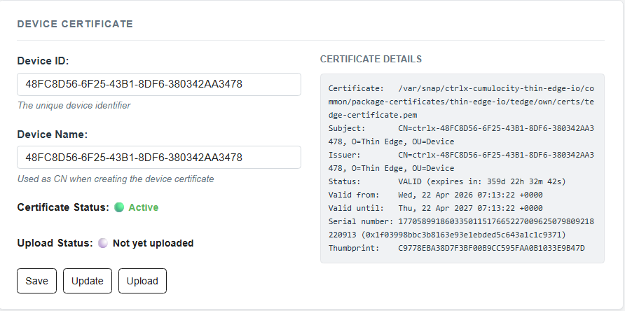

| Element | Description |
|---|---|
| **Device ID** | The CN in the certificate, e.g. `ctrlx-48FC8D56-6F25-43B1-8DF6-380342AA3478` |
| **Create / Renew Certificate** | Generates a new self-signed certificate |
| **Upload Certificate to C8y** | Registers the certificate with the Cumulocity tenant |
| **Upload Status** | Shows whether the certificate has been uploaded |

> **Note**: The Device ID is derived automatically from the hardware:  
> DMI product serial → board serial → chassis serial → product UUID → `/etc/machine-id`  
> It is always prefixed with `ctrlx-`.

**Steps to set up a new device:**
1. Set the **Device ID** (auto-detected or manually entered)
2. Click **Create Certificate**
3. Click **Upload Certificate to C8y**
4. Proceed to [Connect Device](#5-connect-device)

---

## 5. Connect Device

**Section**: "Connect Device"

Establish or disconnect the cloud bridge connection.

> **Screenshot**: "Connect Device" section — all buttons visible
>
> 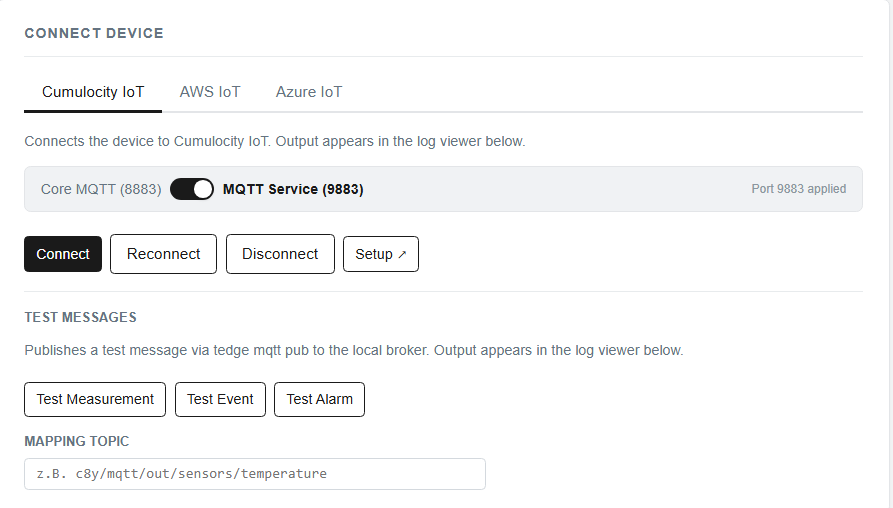

| Button | Description |
|---|---|
| **Connect C8y** | Runs `tedge connect c8y`, writes bridge config, restarts mosquitto |
| **Disconnect C8y** | Runs `tedge disconnect c8y` |
| **Reconnect C8y** | Disconnect + connect in one step |
| **Connect / Disconnect AWS / Azure** | Same actions for the respective cloud |

After connecting, the [Connection Status](#2-connection-status) section will show the `c8y` bridge as 🟢 running.

---

## 6. Logs & Diagnostics

**Section**: "Logs & Diagnostics"

View live log output from all services and upload diagnostics to Cumulocity.

> **Screenshot**: "Logs & Diagnostics" section — service dropdown open + log output visible
>
> 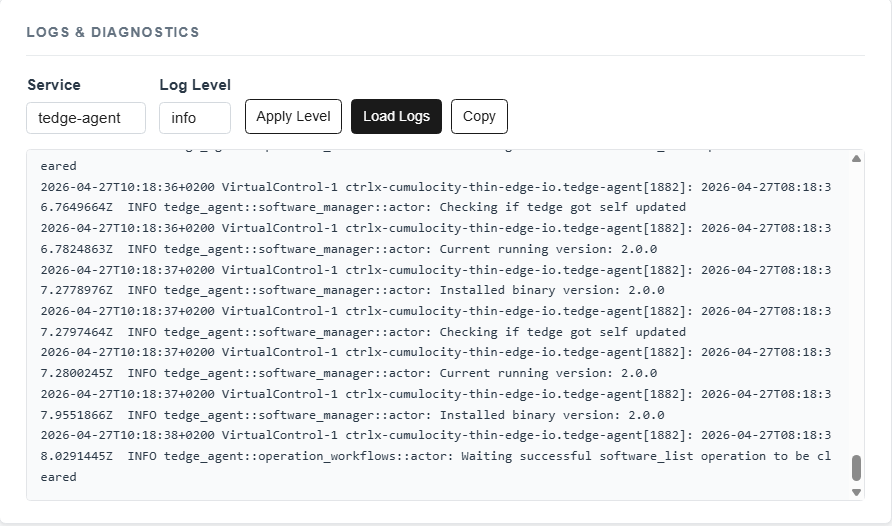

| Control | Description |
|---|---|
| **Service dropdown** | Select service: `tedge-mapper-c8y`, `webserver`, `tedge-datalayer-bridge`, etc. |
| **Log level** | Set verbosity (trace / debug / info / warn / error) — takes effect on next restart |
| **Refresh** | Fetch the latest log lines |
| **Download** | Save the full log file |
| **Diagnose hochladen** | Collect a diagnostics bundle (journalctl logs, snap info, network) and upload it to Cumulocity as an event binary attachment |

### Diagnostics Upload

Clicking **"Diagnose hochladen"** triggers the `diag_upload` operation:

1. Collects logs from all snap services via `journalctl`
2. Includes `snap info`, network interfaces, and routing tables
3. Packages everything into a `.tar.gz` archive
4. Uploads the archive to Cumulocity as a binary attachment on a `c8y_Upload` event

The operation requires an active Cumulocity connection. The upload status is shown in the log viewer.

---

## 7. Device Configuration

**Section**: "Device Configuration"

Edit the thin-edge device and cloud settings directly.

> **Screenshot**: "Device Configuration" section — fields filled in
>
> 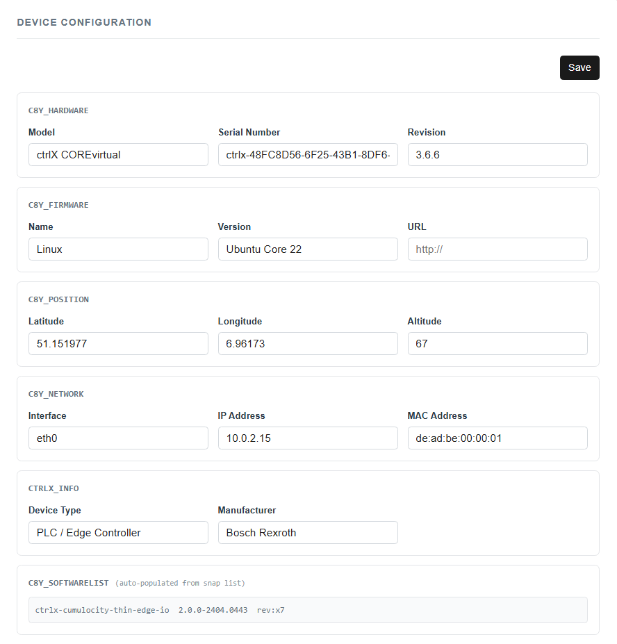

Shows the current configuration values and allows direct editing of:
- Device ID / name
- Cloud URLs and connection state
- Certificate upload status

Click **Save Configuration** to apply changes.

---

## 8. Tedge Configuration

**Section**: "Tedge Configuration"

View and edit the raw `tedge config` key-value pairs.

> **Screenshot**: "Tedge Configuration" section — config list visible
>
> 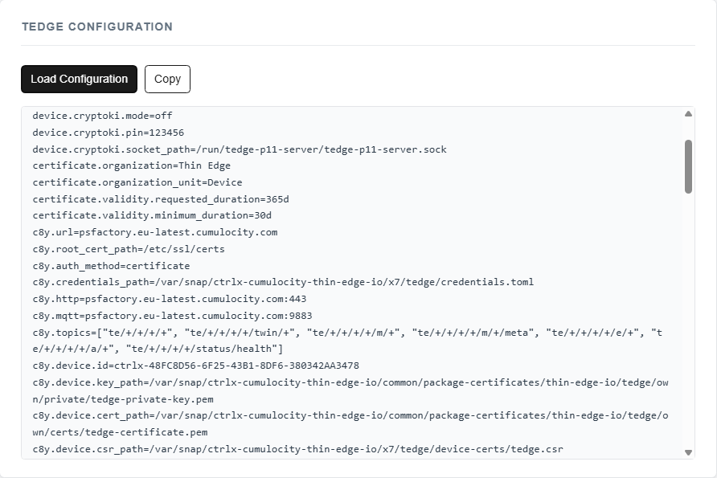

Displays the full output of `tedge config list`. Individual values can be updated directly. This is useful for advanced settings not covered by the standard UI (e.g. custom MQTT host, keepalive intervals).

---

## 9. Configuration Files

**Section**: "Configuration Files"

Browse and edit snap configuration files directly in the browser.

> **Screenshot**: "Configuration Files" section — file list
>
> 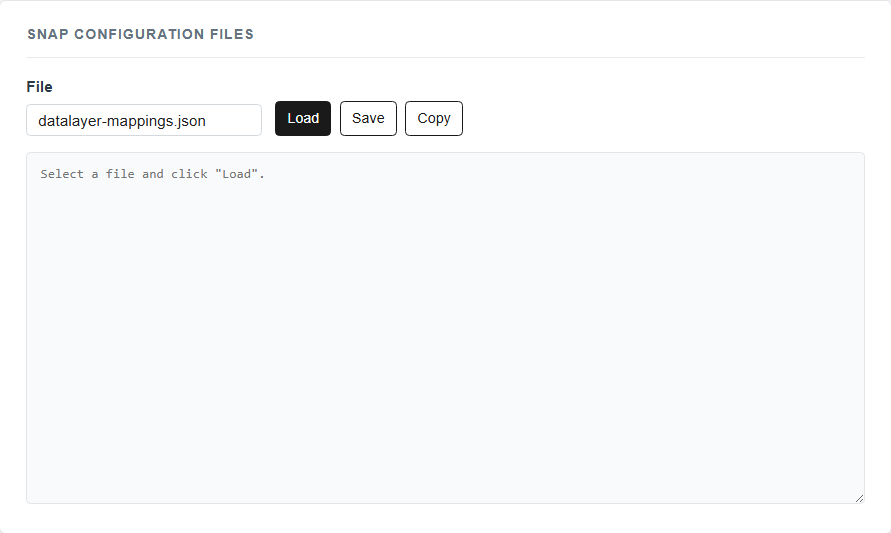

Files are stored under `$SNAP_DATA` and `$SNAP_COMMON`. Edits are saved directly to disk.

---

## 10. ctrlX Datalayer Mapping

**Section**: "ctrlX Datenpunkte (Datalayer)"

Bridge ctrlX Datalayer nodes to Cumulocity via MQTT. Publish PLC data as measurements, events, or alarms to the cloud.

> **Screenshot**: Full "ctrlX Datalayer" section overview
>
> 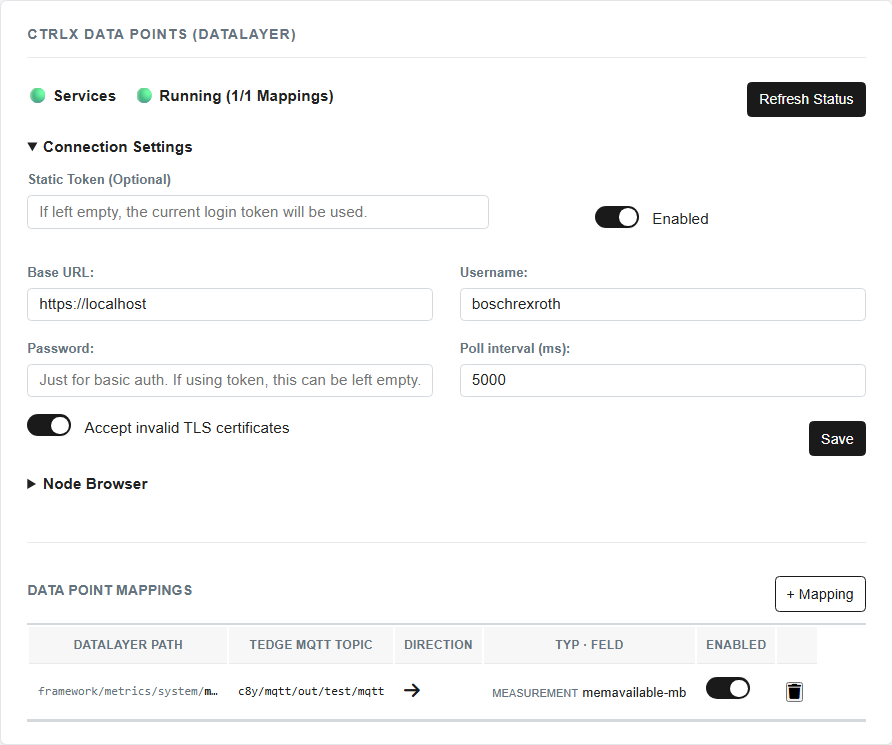

---

### 10.1 Connection Settings

Configure the ctrlX Datalayer REST API connection.

> **Screenshot**: "Connection Settings" accordion expanded
>
> 

| Field | Description | Default |
|---|---|---|
| **Enable** | Activate/deactivate the datalayer bridge | off |
| **Base URL** | ctrlX Datalayer API URL | `https://localhost` |
| **Username** | ctrlX login username | — |
| **Password** | ctrlX login password | — |
| **Accept Invalid Certs** | Skip TLS verification (required for `https://localhost`) | on |
| **Poll Interval (ms)** | How often to read datalayer node values | `5000` |

Click **Save** to apply. The bridge reads the configuration on every poll cycle, so no restart is required.

---

### 10.2 Node Browser

Browse available ctrlX Datalayer nodes.

> **Screenshot**: "Node Browser" accordion expanded — tree with nodes visible
>
> 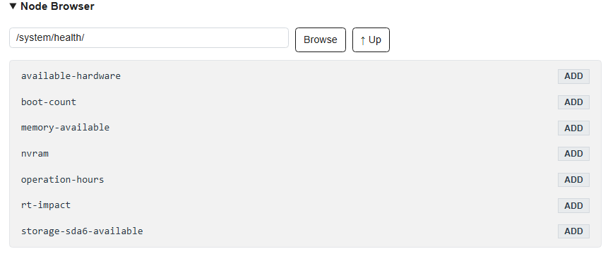

- Click a **folder node** to expand it
- Click a **leaf node** to pre-fill the [mapping form](#103-mapping-form) with its path
- Click **Refresh** to reload the node tree from the Datalayer API

---

### 10.3 Mapping Form

Add or edit a single Datalayer → MQTT mapping.

> **Screenshot**: Mapping form — Measurement transform, all fields filled in
>
> 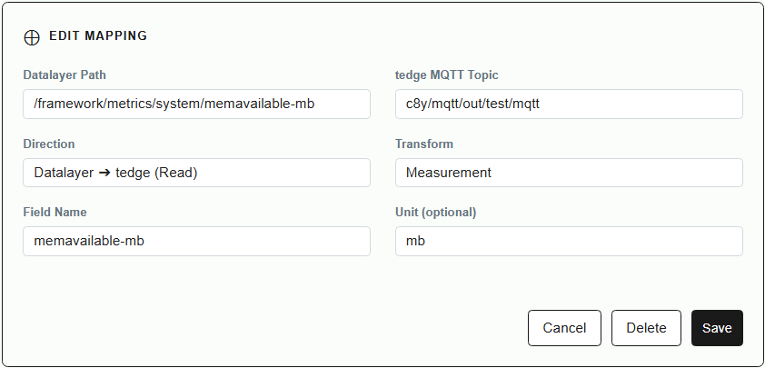

| Field | Description |
|---|---|
| **Datalayer Path** | Path to the node in the ctrlX Datalayer, e.g. `motion/axs/Axis1/state/values/actualposition` |
| **Direction** | `Datalayer → tedge` (read from PLC) or `tedge → Datalayer` (write to PLC) |
| **Field Name** | Label used in the outgoing JSON payload, e.g. `temperature` |
| **MQTT Topic** | Target MQTT topic — auto-filled based on transform type and port (editable) |
| **Transform** | How to convert the value (see below) |
| **Unit** | Optional unit label, e.g. `°C`, `bar`, `rpm` |
| **Enabled** | Toggle to activate/deactivate without deleting |

**Transform types and generated payloads:**

#### Measurement (port 8883)
Topic: `te/device/main///m/<fieldName>`
```json
{
  "temperature": 23.5,
  "unit": "°C",
  "time": "2026-04-24T08:00:05.450Z"
}
```

#### Measurement (port 9883 — MQTT Service)
Topic: `c8y/mqtt/out/<path>`
```json
{
  "externalId": "ctrlx-48FC8D56-6F25-43B1-8DF6-380342AA3478",
  "temperature": 23.5,
  "unit": "°C",
  "time": "2026-04-24T08:00:05.450Z"
}
```

#### Event (port 9883)
Topic: `c8y/mqtt/out/<path>`
```json
{
  "externalId": "ctrlx-48FC8D56-6F25-43B1-8DF6-380342AA3478",
  "Text": {
    "mainDiagnosisCode": "0x00010001",
    "text": "System start completed",
    "timestamp": "2026-04-24T08:00:05.450Z",
    "severity": "Informational",
    "origin": "System"
  },
  "type": "c8y_object",
  "time": "2026-04-24T08:00:05.450Z"
}
```

#### Alarm (port 9883)
Topic: `c8y/mqtt/out/<path>`
```json
{
  "externalId": "ctrlx-48FC8D56-6F25-43B1-8DF6-380342AA3478",
  "Text": {
    "mainDiagnosisCode": "0x08010101",
    "text": "Axis 1: Error in drive power stage",
    "timestamp": "2026-04-24T10:15:30.123Z",
    "severity": "ERROR",
    "origin": "Motion/Axis1"
  },
  "severity": "ERROR",
  "status": "ACTIVE",
  "type": "c8y_object",
  "time": "2026-04-24T10:15:30.123Z"
}
```

> **Note on `type` field**: The value is built from the Datalayer node's `type` field with a `c8y_` prefix. If the node reports `"type": "object"`, the outgoing field will be `"type": "c8y_object"`.

> **Screenshot**: Mapping form — Event transform selected
>
> 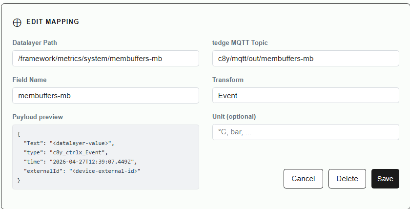

> **Screenshot**: Mapping form — Alarm transform selected
>
> 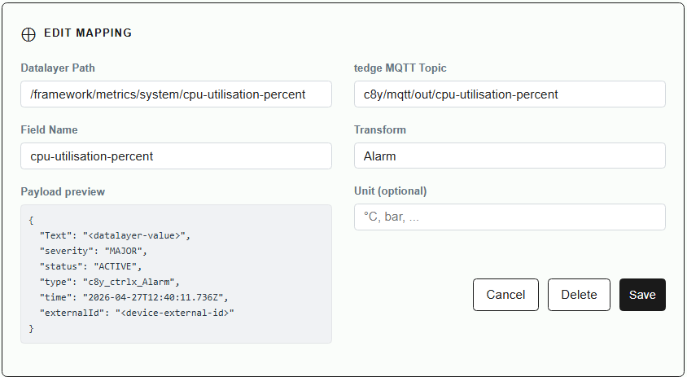

Click **Add Mapping** (new) or **Save** (edit). Changes take effect immediately — no restart required.

---

### 10.4 Mapping Table

Overview of all configured mappings.

> **Screenshot**: Mapping table with several entries visible
>
> 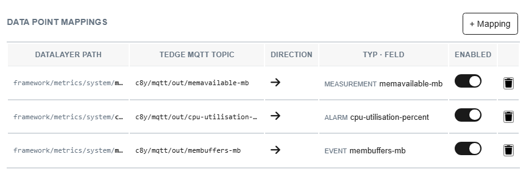

| Column | Description |
|---|---|
| **Path** | ctrlX Datalayer path |
| **Topic** | MQTT topic |
| **Transform** | measurement / event / alarm / raw |
| **Direction** | dl→tedge or tedge→dl |
| **Enabled** | Active state toggle |
| **Actions** | Edit ✎ or Delete 🗑 |

---

## 11. C8y Operations & Remote Management

This snap supports several Cumulocity operations that can be triggered remotely from the Cumulocity IoT platform.

### Remote Access

The `c8y-remote-access-plugin` is automatically registered at snap startup.  
It enables SSH or VNC connections directly from the Cumulocity UI under **Device → Remote Access** without any manual configuration.

**Requirements**: The Cumulocity tenant must have the Remote Access microservice enabled.

### Firmware Updates

The `c8y-firmware-plugin` runs as a snap daemon and handles Cumulocity firmware update operations.  
Firmware can be pushed from **Device Management → Firmware** in the Cumulocity UI.

### Log File Upload

The `c8y-log-upload` operation allows Cumulocity to request log files from the device.  
Supported log sources are configured via the `log-plugins` directory and `tedge-file-log-plugin`.

Available log types (configurable):
- `tedge-agent`
- `tedge-mapper-c8y`
- `tedge-datalayer-bridge`
- `mosquitto`

Trigger via **Device Management → Logs** in Cumulocity or use the **Logs & Diagnostics** section in the web UI.

### Configuration Management

The `c8y-config-management` operation allows reading and updating configuration files remotely.  
Supported files are registered via `config-plugins` and `tedge-file-config-plugin`.

### Diagnostics Upload

The `diag_upload` custom operation collects a full diagnostics bundle (logs, snap info, network) and uploads it as an event binary attachment to Cumulocity.  
Can be triggered from the **Logs & Diagnostics** section in the web UI.

---

## 12. ctrlX Licensing

**Section**: "ctrlX Licensing"

Manage the license required to run this snap.

> **Screenshot**: "ctrlX Licensing" section — license list visible
>
> 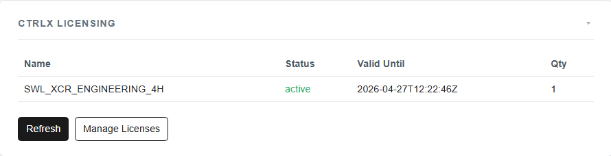

| Element | Description |
|---|---|
| **License Status** | Active / not licensed |
| **Manage Licenses** | Opens `/license-manager` in the ctrlX web interface |
| **License List** | Shows capabilities assigned to this snap |

**Required license**: `SWL-XCx-RUN-DLACCESSNRTxx-NNNN`  
**Trial license**: `SWL_XCR_ENGINEERING_4H` (4-hour engineering license, no purchase required)

If no valid license is held, a **red warning banner** appears at the top of the page.


---

## 13. System Information

**Section**: "System Information"

Shows hardware, OS, network, and installed snap package information.

> **Screenshot**: "System Information" section — all fields visible
>
> 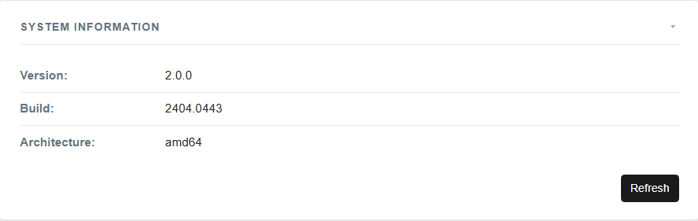

Data shown includes:
- Hardware serial number / product UUID
- OS version and architecture
- Network interfaces and IP addresses
- Installed snap packages with versions
- Build information of this snap

This information is also published to Cumulocity as the device inventory (twin topics).

---

## Screenshots Checklist

The UI is at: `https://<ctrlx-ip>/thin-edge-io/`  
Save screenshots to: `docs/pictures/`

| File | Section | What to show |
|---|---|---|
| `09c-mapping-form-measurement.png` | Mapping Form | no |
| `09d-mapping-form-event.png` | Mapping Form | no |
| `09e-mapping-form-alarm.png` | Mapping Form | no |
| `09f-mapping-table.png` | Mapping Table | no |

