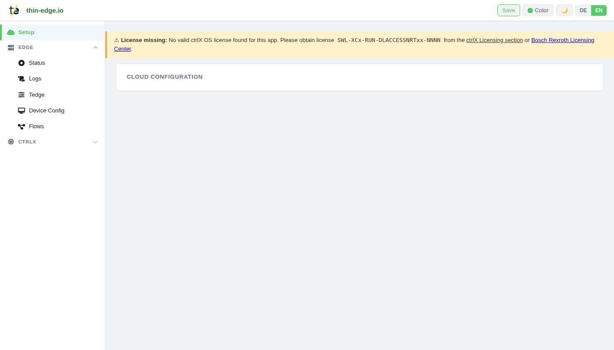
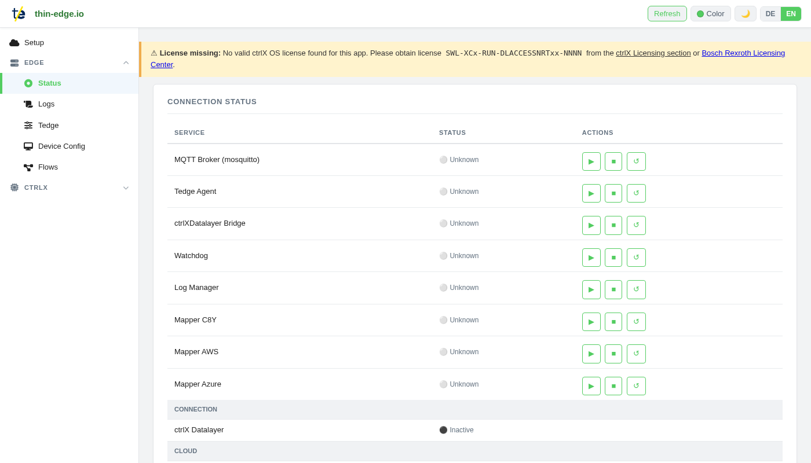
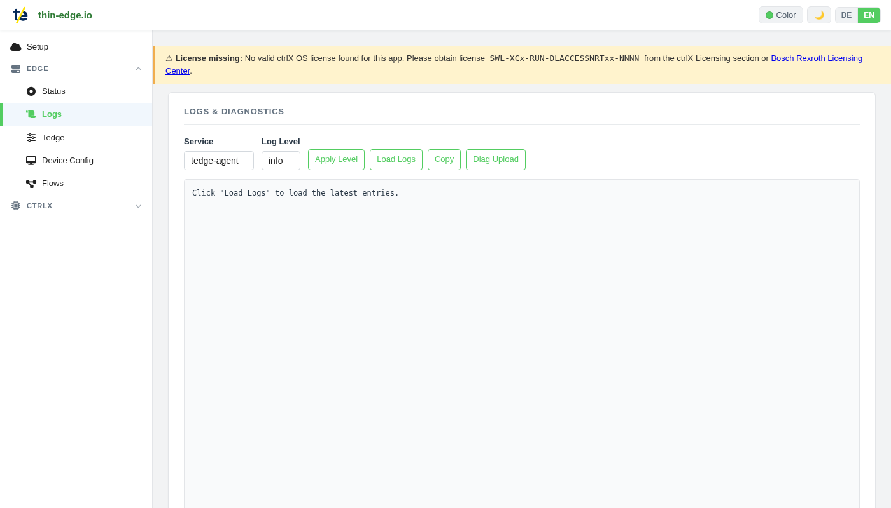
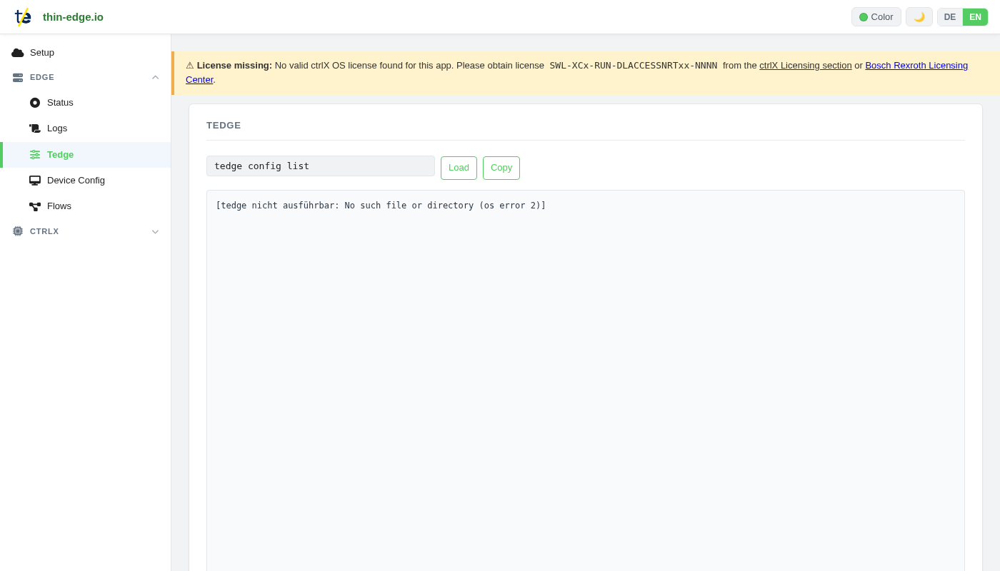
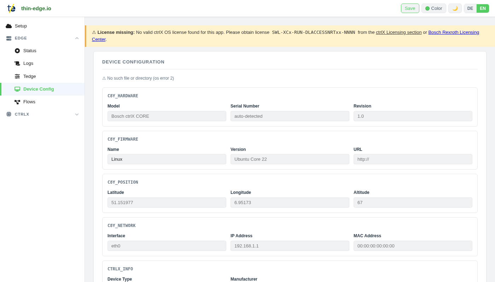
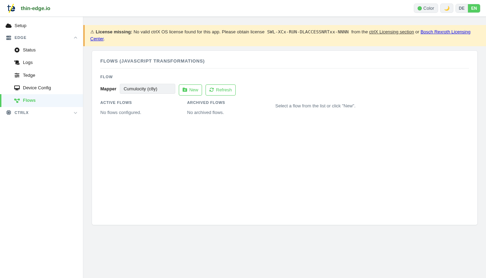
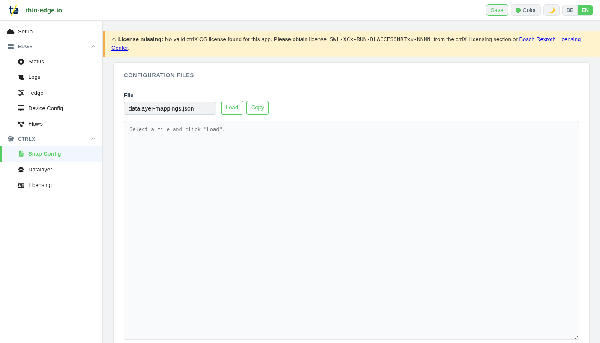
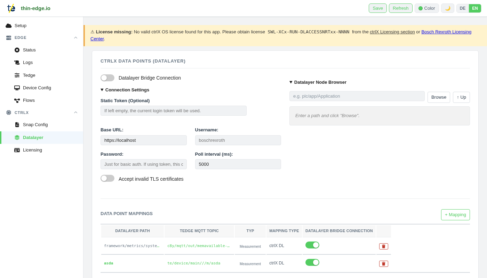
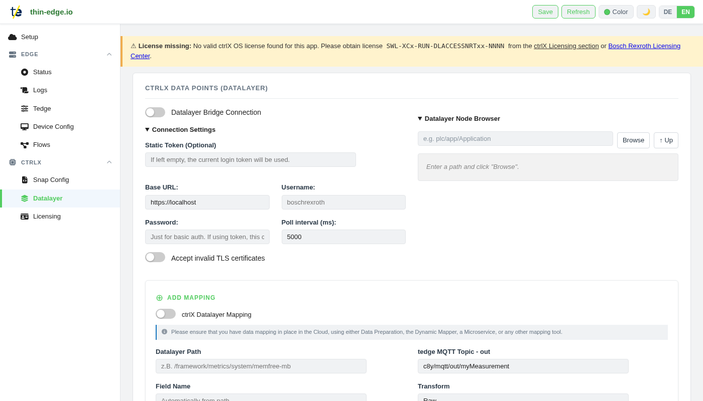
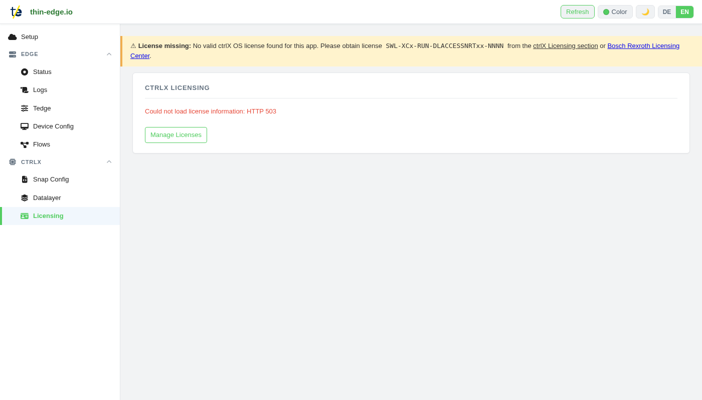

# ctrlX Cumulocity thin-edge.io — User Manual

**App**: `ctrlx-cumulocity-thin-edge-io`  
**UI URL**: `https://<ctrlx-ip>/thin-edge-io/`

> **Screenshots**: Take one screenshot per section listed in the [checklist](#screenshots-checklist) at the end of this document. Save them to `docs/pictures/` and replace each `` placeholder.

---

## Table of Contents

1. [Overview](#1-overview)
2. [Setup — Cloud & Certificate](#2-setup--cloud--certificate)
   - [Cloud Configuration](#21-cloud-configuration)
   - [Device & Certificate](#22-device--certificate)
3. [Edge: Status](#3-edge-status)
4. [Edge: Logs](#4-edge-logs)
5. [Edge: Tedge](#5-edge-tedge)
6. [Edge: Device Config](#6-edge-device-config)
7. [Edge: Flows](#7-edge-flows)
8. [ctrlX: Snap Config](#8-ctrlx-snap-config)
9. [ctrlX: Datalayer](#9-ctrlx-datalayer)
   - [Connection Settings](#91-connection-settings)
   - [Node Browser](#92-node-browser)
   - [Mapping Form](#93-mapping-form)
   - [Mapping Table](#94-mapping-table)
10. [ctrlX: Licensing](#10-ctrlx-licensing)
11. [C8y Operations & Remote Management](#11-c8y-operations--remote-management)
12. [Screenshots Checklist](#screenshots-checklist)

---

## 1. Overview

The **ctrlX Cumulocity thin-edge.io** app connects a ctrlX AUTOMATION controller to the Cumulocity IoT platform. It forwards telemetry data, manages device certificates, and bridges ctrlX Datalayer nodes to the cloud.

**Access**: Open the ctrlX app bar and click **thin-edge.io**, or navigate directly to `https://<ctrlx-ip>/thin-edge-io/`.

### Navigation

The left sidebar is divided into two groups:

| Group | Pages |
|---|---|
| **Edge** | Status, Logs, Tedge, Device Config, Flows |
| **ctrlX** | Snap Config, Datalayer, Licensing |

The **Setup** item at the top of the sidebar opens the main configuration page (Cloud + Certificate).

The language toggle (DE / EN) in the top-right corner switches the UI language.  
The sun/moon icon toggles light/dark theme.

> **License banner**: A yellow warning banner at the top of every page indicates that no valid ctrlX OS license was found. Obtain license `SWL-XCx-RUN-DLACCESSNRTxx-NNNN` or the 4-hour trial license `SWL_XCR_ENGINEERING_4H` from the Licensing section.

---

## 2. Setup — Cloud & Certificate

**Nav item**: Setup

The main configuration page. Contains the **Cloud Configuration** accordion with three columns: Cloud, Device & Certificate, and Certificate details.

> **Screenshot**: Setup page — Cloud Configuration accordion expanded
>
> 

---

### 2.1 Cloud Configuration

#### Cumulocity IoT tab

| Field | Description | Example |
|---|---|---|
| **C8Y URL** | Cumulocity tenant hostname | `https://your-tenant.cumulocity.com` |
| **Port toggle** | Core MQTT (8883) ↔ MQTT Service (9883) | 8883 |

> **Note on port 9883 (MQTT Service)**: Switching to 9883 activates the Cumulocity MQTT Service protocol. Existing Datalayer mappings that use `te/` topics must be reconfigured to use `c8y/mqtt/out/` prefixes. Switching back to 8883 re-enables them.

**Connection buttons:**

| Button | Description |
|---|---|
| **Connect** | Runs `tedge connect c8y`, writes bridge config, restarts mosquitto |
| **Reconnect** | Disconnect + connect in one step |
| **Disconnect** | Runs `tedge disconnect c8y` |
| **Setup ↗** | Opens the thin-edge.io online setup guide |

#### AWS IoT tab

| Field | Description |
|---|---|
| **AWS URL** | IoT endpoint, e.g. `xxxxxxx.iot.eu-west-1.amazonaws.com` |

#### Azure IoT tab

| Field | Description |
|---|---|
| **Azure URL** | IoT Hub hostname |

Click **Save** (top-right toolbar) to persist configuration changes.

---

### 2.2 Device & Certificate

Located in the right column of the Cloud Configuration accordion.

A toggle switches between two certificate modes: **CA-Certificate** and **Self-Signed**.

#### Self-Signed Mode (default)

| Element | Description |
|---|---|
| **Device ID** | Read-only; hardware-derived identifier, e.g. `d78c928ee82c5f33b38a00de69ef260d` |
| **External Device ID** | Editable CN used as the certificate subject, e.g. `ctrlx-d78c928ee82c5f33b38a00de69ef260d` |
| **Certificate Status** | 🔴 Missing / 🟢 Valid |
| **Upload Status** | ⚪ Not yet uploaded / 🟢 Uploaded |
| **Renew** | Recreates the self-signed certificate with the current External Device ID |
| **Upload Certificate** | Expands a form to enter Cumulocity credentials and upload the certificate |

> **Note**: The Device ID is derived from hardware in this order:  
> DMI product serial → board serial → chassis serial → product UUID → `/etc/machine-id`

**Steps to set up a new device (self-signed):**
1. Verify the **External Device ID** (auto-detected)
2. Click **Renew** to create the certificate
3. Click **Upload Certificate** and enter Cumulocity credentials
4. Click **Connect** in the Cloud column

#### CA-Signed Mode

| Element | Description |
|---|---|
| **External Device ID** | CN sent in the Certificate Signing Request |
| **Download Status** | Whether the signed certificate was downloaded from the CA |
| **Request Certificate** | Sends a CSR to the configured CA and downloads the signed certificate |

#### Certificate Details panel (right column)

Shown when a valid certificate exists. Displays subject, issuer, validity dates, and fingerprint.

---

## 3. Edge: Status

**Nav item**: Edge → Status

Shows the runtime state of all services and cloud connections.

> **Screenshot**: Connection Status page
>
> 

**Toolbar**: **Refresh** button reloads all service states.

### Services table

| Service | Description |
|---|---|
| MQTT Broker (mosquitto) | Local MQTT broker |
| Tedge Agent | thin-edge device agent |
| ctrlXDatalayer Bridge | ctrlX Datalayer → MQTT bridge |
| Watchdog | Service health watchdog |
| Log Manager | Log upload manager |
| Mapper C8Y | Cumulocity cloud mapper |
| Mapper AWS | AWS IoT mapper |
| Mapper Azure | Azure IoT Hub mapper |

**Status indicators:**

| Symbol | Meaning |
|---|---|
| 🟢 Running | Service is active |
| 🔴 Stopped | Service has stopped |
| ⚫ Inactive | Not configured / disabled |
| ⚪ Unknown | State could not be determined |

**Action buttons per service:**

| Button | Action |
|---|---|
| ▶ | Start the service |
| ■ | Stop the service |
| ↺ | Restart the service |

### Connection table

| Row | Description |
|---|---|
| **ctrlX Datalayer** | Bridge connection state (Inactive when disabled) |
| **Cumulocity IoT** | Cloud MQTT bridge state |
| **AWS IoT** | AWS bridge state |
| **Azure IoT** | Azure bridge state |

Connection rows have no action buttons (controlled via Setup or Datalayer sections).

---

## 4. Edge: Logs

**Nav item**: Edge → Logs

View live log output from all services and upload diagnostics to Cumulocity.

> **Screenshot**: Logs & Diagnostics page
>
> 

| Control | Description |
|---|---|
| **Service** dropdown | `tedge-agent`, `tedge-mapper`, `tedge-bridge`, `log-upload`, `mosquitto`, `webserver`, `snap-hooks` |
| **Log Level** dropdown | `error` / `warn` / `info` / `debug` / `trace` |
| **Apply Level** | Sets the log level for the selected service (takes effect on next restart) |
| **Load Logs** | Fetches the latest log lines into the output area |
| **Copy** | Copies the log output to clipboard |
| **Diag Upload** | Collects a full diagnostics bundle and uploads it to Cumulocity |

### Diagnostics Upload

Clicking **Diag Upload** triggers the `diag_upload` operation:

1. Collects logs from all snap services via `journalctl`
2. Includes `snap info`, network interfaces, and routing tables
3. Packages everything into a `.tar.gz` archive
4. Uploads the archive to Cumulocity as a binary attachment on a `c8y_Upload` event

Requires an active Cumulocity connection.

---

## 5. Edge: Tedge

**Nav item**: Edge → Tedge

Run diagnostic `tedge` commands and view their output.

> **Screenshot**: Tedge page
>
> 

Select a command from the dropdown and click **Load**:

| Command | Description |
|---|---|
| `tedge config list` | All currently set configuration values |
| `tedge config list --all` | All values including defaults |
| `tedge config list --doc` | All values with inline documentation |
| `tedge bridge inspect c8y` | Active Mosquitto bridge configuration for C8y |

- **Load** — fetches the selected command output
- **Copy** — copies the output to clipboard

---

## 6. Edge: Device Config

**Nav item**: Edge → Device Config

Edit the Cumulocity device inventory data sent as the device twin. All fields are grouped by inventory fragment type.

> **Screenshot**: Device Configuration page
>
> 

| Group | Fields |
|---|---|
| **c8y_Hardware** | Model, Serial Number, Revision |
| **c8y_Firmware** | Name, Version, URL |
| **c8y_Position** | Latitude, Longitude, Altitude |
| **c8y_Network** | Interface, IP Address, MAC Address |
| **ctrlX_Info** | Device Type, Manufacturer |
| **c8y_SoftwareList** | Auto-populated from `snap list` output |

Click **Save** (top-right toolbar) to write the values to `inventory.json` and republish to Cumulocity.

---

## 7. Edge: Flows

**Nav item**: Edge → Flows

Manage thin-edge.io **flow scripts** — JavaScript-based MQTT message transformation pipelines.

> **Screenshot**: Flows page
>
> 

**Toolbar:**

| Control | Description |
|---|---|
| **Mapper** selector | Target mapper: `Cumulocity (c8y)`, `AWS IoT (aws)`, `Azure IoT (az)` |
| **New** | Creates a new flow directory with a `flow.toml` + `main.js` template |
| **Refresh** | Reloads the flows list from disk |

**Left panel:**

- **Active Flows**: lists all active flow directories and their files. Click a file name to open it in the editor. Each flow has an **Archive** button to deactivate it.
- **Archived Flows**: lists archived flows. Each has a **Restore** button to reactivate it.

**Right panel — File Editor:**

- Displays the selected file in a monospace editor
- **Save** — writes the file to disk immediately
- **Delete File** — removes the selected file
- **Add File** — adds a new file to the current flow (allowed extensions: `.js`, `.toml`, `.toml.template`)

A new flow is pre-created with a `flow.toml` defining the input MQTT topic and a `main.js` script reference.

---

## 8. ctrlX: Snap Config

**Nav item**: ctrlX → Snap Config

Browse and edit snap configuration files directly in the browser.

> **Screenshot**: Configuration Files page
>
> 

**File** dropdown — select a file:

| File | Description |
|---|---|
| `datalayer-mappings.json` | Datalayer → MQTT mapping definitions |
| `inventory.json` | Custom device inventory fragment |
| `snap-inventory.json` | Auto-generated snap inventory |
| `tedge-web-config.json` | Web UI runtime configuration |
| `tedge.toml` | thin-edge.io main configuration |
| `tedge-log-plugin.toml` | Log upload plugin sources |
| `tedge-configuration-plugin.toml` | Config management plugin sources |

- **Load** — loads the selected file into the editor
- **Copy** — copies the current content to clipboard
- Edits to the text area can be saved with **Save** (top-right toolbar)

Files are stored under `$SNAP_DATA`. Changes are written directly to disk.

---

## 9. ctrlX: Datalayer

**Nav item**: ctrlX → Datalayer

Bridge ctrlX Datalayer nodes to Cumulocity via MQTT. Reads PLC data on a configurable poll interval and publishes it as measurements, events, or alarms.

> **Screenshot**: ctrlX Data Points (Datalayer) page — overview
>
> 

**Toolbar**: **Save** and **Refresh** buttons in the top-right corner.

**Datalayer Bridge Connection** toggle at the top of the page — enables/disables the bridge globally.

---

### 9.1 Connection Settings

| Field | Description | Default |
|---|---|---|
| **Static Token (Optional)** | Bearer token for authentication; if empty, the current ctrlX login token is used | — |
| **Base URL** | ctrlX Datalayer REST API URL | `https://localhost` |
| **Username** | ctrlX login username | `boschrexroth` |
| **Password** | Password for basic auth; leave empty when using a token | — |
| **Poll interval (ms)** | How often to read Datalayer node values | `5000` |
| **Accept invalid TLS certificates** | Skip TLS verification (required for `https://localhost`) | off |

Click **Save** to apply. No restart required.

---

### 9.2 Node Browser

Located in the right column of the Datalayer page.

| Control | Description |
|---|---|
| Path input | Enter a Datalayer node path, e.g. `plc/app/Application` |
| **Browse** | Lists child nodes at the given path |
| **↑ Up** | Navigates one level up in the node tree |

Click a returned node to pre-fill the mapping form's Datalayer Path field.

---

### 9.3 Mapping Form

Opened by clicking **+ Mapping** or clicking a row in the mapping table.

> **Screenshot**: Datalayer — Add Mapping form open
>
> 

**ctrlX Datalayer Mapping** toggle at the top of the form — enables/disables this specific mapping.

> **Note**: Ensure that appropriate data mapping is configured in Cumulocity (via Data Preparation, Dynamic Mapper, a microservice, or another tool) to process the incoming MQTT messages.

| Field | Description |
|---|---|
| **Datalayer Path** | Full path to the Datalayer node, e.g. `/framework/metrics/system/memfree-mb` |
| **Field Name** | JSON key in the outgoing payload; auto-derived from path if left empty |
| **Unit (optional)** | Unit label, e.g. `°C`, `bar`, `rpm` |
| **tedge MQTT Topic - out** | MQTT topic to publish to; auto-suggested based on transform type |
| **Transform** | Payload conversion: `Raw`, `Measurement`, `Event`, `Alarm` |

**Preview panels (read-only):**

| Panel | Description |
|---|---|
| **Datalayer Output** | Last raw value read from the Datalayer node |
| **Payload Preview** | The JSON payload that would be published to MQTT |

**Transform types and generated topics:**

| Transform | Port 8883 topic | Port 9883 topic |
|---|---|---|
| Raw | `te/device/main///m/<field>` | `c8y/mqtt/out/<field>` |
| Measurement | `te/device/main///m/<field>` | `c8y/mqtt/out/<field>` |
| Event | `te/device/main///e/<field>` | `c8y/mqtt/out/<field>` |
| Alarm | `te/device/main///a/<field>` | `c8y/mqtt/out/<field>` |

Click **Save** to add/update the mapping. Changes take effect on the next poll cycle.  
Click **Cancel** to discard.

---

### 9.4 Mapping Table

**DATA POINT MAPPINGS** section — shows all configured mappings.

| Column | Description |
|---|---|
| **Datalayer Path** | Source node path (last segment highlighted) |
| **tedge MQTT Topic** | Target MQTT topic |
| **Typ** | Transform type: Measurement / Event / Alarm / Raw |
| **Mapping Type** | Always `ctrlX DL` for Datalayer mappings |
| **Datalayer Bridge Connection** | Per-mapping enable/disable toggle |
| *(delete)* | 🗑 button to remove the mapping |

Click a row to open it in the mapping form for editing.

---

## 10. ctrlX: Licensing

**Nav item**: ctrlX → Licensing

Manage the license required to activate this snap.

> **Screenshot**: ctrlX Licensing page
>
> 

| Element | Description |
|---|---|
| License status message | Displays the current license state or an error |
| **Manage Licenses** | Opens `/license-manager` in the ctrlX web interface |

**Required license**: `SWL-XCx-RUN-DLACCESSNRTxx-NNNN`  
**Trial license**: `SWL_XCR_ENGINEERING_4H` (4-hour engineering license, no purchase required)

If no valid license is found, a **yellow warning banner** appears at the top of every page.

---

## 11. C8y Operations & Remote Management

This snap supports several Cumulocity operations that can be triggered remotely from the Cumulocity IoT platform.

### Remote Access

The `c8y-remote-access-plugin` is automatically registered at snap startup.  
It enables SSH or VNC connections from **Device → Remote Access** in the Cumulocity UI without any manual setup.

**Requirement**: The Cumulocity tenant must have the Remote Access microservice enabled.

### Firmware Updates

The `c8y-firmware-plugin` runs as a snap daemon and handles Cumulocity firmware update operations.  
Trigger via **Device Management → Firmware** in the Cumulocity UI.

### Log File Upload

The `c8y-log-upload` operation allows Cumulocity to request log files from the device.  
Trigger via **Device Management → Logs** in Cumulocity, or use **Diag Upload** in the Logs section.

Available log types:
- `tedge-agent`, `tedge-mapper-c8y`, `tedge-datalayer-bridge`, `mosquitto`, `webserver`, `log-upload-manager`

### Configuration Management

The `c8y-config-management` operation allows reading and updating configuration files remotely.  
Supported files are those listed in the **Snap Config** section.

### Diagnostics Upload

The `diag_upload` custom operation collects a full diagnostics bundle and uploads it as an event binary attachment to Cumulocity.  
Trigger from the **Logs** section via **Diag Upload**.

---

## Screenshots Checklist

UI URL: `https://<ctrlx-ip>/thin-edge-io/`  
Save screenshots to: `docs/pictures/`

| File | Section | What to capture |
|---|---|---|
| `01-setup.png` | Setup | Cloud Configuration accordion expanded — all three columns visible |
| `02-status.png` | Edge: Status | Connection Status table with services and action buttons |
| `03-logs.png` | Edge: Logs | Logs & Diagnostics — controls visible, log output area |
| `04-tedge.png` | Edge: Tedge | Tedge — command dropdown + output area |
| `05-device-config.png` | Edge: Device Config | Device Configuration — all inventory groups visible |
| `06-flows.png` | Edge: Flows | Flows — empty state with mapper selector and New/Refresh buttons |
| `07-snap-config.png` | ctrlX: Snap Config | Configuration Files — file dropdown + editor area |
| `08-datalayer.png` | ctrlX: Datalayer | Full Datalayer page — Connection Settings + Node Browser + mapping table |
| `08b-datalayer-mapping-form.png` | ctrlX: Datalayer | Add Mapping form open with all fields visible |
| `09-licensing.png` | ctrlX: Licensing | ctrlX Licensing — license status + Manage Licenses link |
